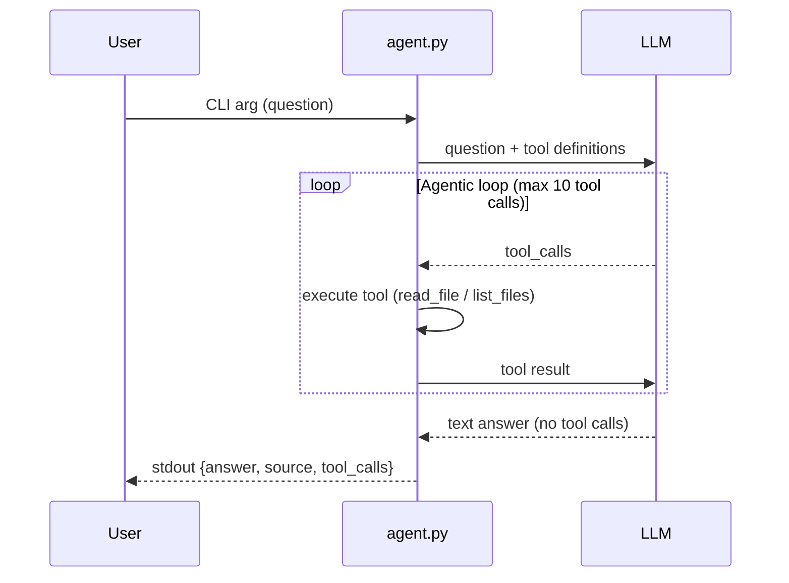

# Agent Architecture

## Overview

`agent.py` is a Python CLI that connects to an LLM via an OpenAI-compatible API and returns structured JSON responses. The agent has tool-calling capabilities that allow it to read files and list directories from the project repository.

## LLM Provider

- **Provider**: Qwen Code API
- **Model**: `qwen3-coder-plus`
- **Deployment**: Self-hosted on VM via `qwen-code-oai-proxy`
- **API Base**: `http://10.93.25.94:42005/v1`

## Architecture

```
┌─────────────┐     ┌──────────────┐     ┌─────────────────┐     ┌─────────────┐
│   User      │────▶│   agent.py   │────▶│  Qwen Code API  │────▶│   LLM       │
│  (CLI arg)  │     │  (CLI Tool)  │     │   (VM Proxy)    │     │  (Cloud)    │
└─────────────┘     └──────────────┘     └─────────────────┘     └─────────────┘
                           │
                           ▼
                    JSON Output
          {answer, source, tool_calls}
```

## Agentic Loop

The agent implements an agentic loop that allows the LLM to call tools iteratively:



### Loop Flow

1. Send the user's question + tool definitions to the LLM
2. If the LLM responds with `tool_calls` → execute each tool, append results as `tool` role messages, go to step 1
3. If the LLM responds with a text message (no tool calls) → that's the final answer
4. If you hit 10 tool calls → stop looping, use whatever answer you have

## Components

### `agent.py`

**Functions:**

| Function | Purpose |
|----------|---------|
| `load_env()` | Loads `.env.agent.secret` configuration |
| `get_project_root()` | Returns the project root directory |
| `is_safe_path(path)` | Validates path is within project directory (security) |
| `read_file(path)` | Tool: reads a file from the repository |
| `list_files(path)` | Tool: lists files/directories at a path |
| `call_llm(messages, tools)` | Sends HTTP POST to LLM API with messages and tool schemas |
| `execute_tool(tool_call)` | Executes a tool call and returns the result |
| `run_agentic_loop(question)` | Main loop: calls LLM, executes tools, iterates |
| `extract_source_from_answer(answer, tool_calls)` | Extracts source reference from tool calls |
| `format_response(answer, source, tool_calls)` | Builds output JSON |
| `main()` | Entry point: parses args, orchestrates flow |

## Tools

The agent has two tools registered as function-calling schemas:

### `read_file`

Read a file from the project repository.

**Parameters:**
- `path` (string, required): Relative path from project root (e.g., `wiki/git-workflow.md`)

**Returns:** File contents as a string, or an error message if the file doesn't exist.

**Security:** Rejects paths that traverse outside the project directory using `../`.

### `list_files`

List files and directories at a given path.

**Parameters:**
- `path` (string, required): Relative directory path from project root (e.g., `wiki`)

**Returns:** Newline-separated listing of entries (directories first, then files), or an error message.

**Security:** Rejects paths that traverse outside the project directory.

## Path Security

Both tools implement path traversal protection:

```python
def is_safe_path(path: str) -> bool:
    project_root = get_project_root()
    resolved = os.path.realpath(os.path.join(project_root, path))
    return resolved.startswith(project_root + os.sep) or resolved == project_root
```

This ensures:
- Paths with `../` that escape the project root are rejected
- Symlinks are resolved to their real paths before validation
- Only files/directories within the project can be accessed

## System Prompt Strategy

The system prompt instructs the LLM to:

1. Use `list_files` to discover relevant wiki files when it doesn't know which file contains the answer
2. Use `read_file` to read specific wiki files and find answers
3. Always cite sources in the format `wiki/filename.md#section-anchor`
4. Respond with a text message (no tool calls) when it has enough information

```
You are a documentation agent that answers questions by reading the project wiki.

Available tools:
- list_files(path): List files and directories in a directory. Use this to discover what files exist.
- read_file(path): Read the contents of a specific file. Use this to find answers in wiki files.

Instructions:
1. Use list_files to discover relevant wiki files when you don't know which file contains the answer.
2. Use read_file to read specific wiki files and find the answer.
3. When you find the answer, provide it along with the source reference.
4. The source should be in the format: wiki/filename.md#section-anchor
5. When you have enough information to answer, respond with a text message (no tool calls).
```

## Configuration

`.env.agent.secret` contains:

| Variable | Description |
|----------|-------------|
| `LLM_API_KEY` | API key for Qwen Code authentication |
| `LLM_API_BASE` | Base URL of the LLM API endpoint |
| `LLM_MODEL` | Model name (e.g., `qwen3-coder-plus`) |

## Usage

```bash
# Run with a question
uv run agent.py "How do you resolve a merge conflict?"

# Output (stdout)
{
  "answer": "Edit the conflicting file, choose which changes to keep, then stage and commit.",
  "source": "wiki/git-workflow.md",
  "tool_calls": [
    {"tool": "list_files", "args": {"path": "wiki"}, "result": "..."},
    {"tool": "read_file", "args": {"path": "wiki/git-workflow.md"}, "result": "..."}
  ]
}
```

## Output Format

```json
{
  "answer": "<LLM response text>",
  "source": "<wiki file path with optional section anchor>",
  "tool_calls": [
    {
      "tool": "<tool name>",
      "args": {"path": "<path>"},
      "result": "<tool output>"
    }
  ]
}
```

- `answer`: The LLM's final answer text
- `source`: The wiki file (and section) that contains the answer
- `tool_calls`: Array of all tool calls made during the agentic loop

## Error Handling

- **Missing CLI argument**: Prints usage to stderr, exits with code 1
- **LLM API error**: Returns error message in JSON `answer` field, exits with code 0
- **Timeout**: 60-second timeout on HTTP requests
- **Path traversal attempt**: Returns error message in tool result
- **File not found**: Returns error message in tool result
- **Max tool calls reached**: Returns partial answer with tool calls made so far

## Dependencies

- `httpx` - HTTP client for API requests
- `python-dotenv` - Environment variable loading
- `json`, `os`, `sys` - Standard library

## Testing

Run the regression tests:

```bash
uv run pytest tests/test_agent.py -v
```

Tests verify:
- `agent.py` runs successfully
- Output is valid JSON
- `answer`, `source`, and `tool_calls` fields exist
- Tools are called appropriately for specific questions
