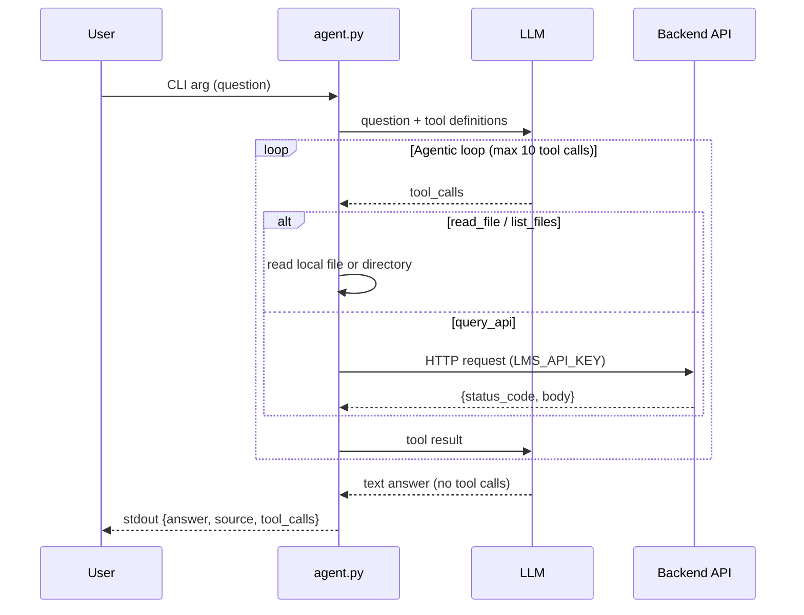

# Agent Architecture

## Overview

`agent.py` is a Python CLI that connects to an LLM via an OpenAI-compatible API and returns structured JSON responses. The agent has tool-calling capabilities that allow it to read files, list directories, and query the backend API for real-time data.

This is the **Task 3 System Agent** — an evolution of the Task 2 documentation agent. In addition to reading wiki files and source code, the agent can now query the deployed backend API using the `query_api` tool. This enables the agent to answer three types of questions:

1. **Wiki lookup** — Documentation questions answered by reading `wiki/*.md` files
2. **System facts** — Static questions about the codebase (framework, ports, routers) answered by reading source code
3. **Data-dependent queries** — Live data questions (item counts, scores, analytics) answered by querying the backend API

## LLM Provider

- **Provider**: Qwen Code API
- **Model**: `qwen3-coder-plus`
- **Deployment**: Self-hosted on VM via `qwen-code-oai-proxy`
- **API Base**: `http://10.93.25.94:42005/v1`

## Architecture

```
┌─────────────┐     ┌──────────────┐     ┌─────────────────┐     ┌─────────────┐
│   User      │────▶│   agent.py   │────▶│  Qwen Code API  │────▶│   LLM       │
│  (CLI arg)  │     │  (CLI Tool)  │     │   (VM Proxy)    │     │  (Cloud)    │
└─────────────┘     └──────────────┘     └─────────────────┘     └─────────────┘
                           │
                           ▼
                    JSON Output
          {answer, source, tool_calls}
                           │
                           ▼
                    ┌──────────────┐
                    │ Backend API  │
                    │ (query_api)  │
                    └──────────────┘
```

## Agentic Loop

The agent implements an agentic loop that allows the LLM to call tools iteratively:



### Loop Flow

1. Send the user's question + tool definitions to the LLM
2. If the LLM responds with `tool_calls` → execute each tool, append results as `tool` role messages, go to step 1
3. If the LLM responds with a text message (no tool calls) → that's the final answer
4. If you hit 10 tool calls → stop looping, use whatever answer you have

## Components

### `agent.py`

**Functions:**

| Function | Purpose |
|----------|---------|
| `load_env()` | Loads `.env.agent.secret` and `.env.docker.secret` configuration |
| `get_project_root()` | Returns the project root directory |
| `is_safe_path(path)` | Validates path is within project directory (security) |
| `read_file(path)` | Tool: reads a file from the repository |
| `list_files(path)` | Tool: lists files/directories at a path |
| `query_api(method, path, body, auth)` | Tool: queries the backend API with authentication |
| `call_llm(messages, tools)` | Sends HTTP POST to LLM API with messages and tool schemas |
| `execute_tool(tool_call)` | Executes a tool call and returns the result |
| `run_agentic_loop(question)` | Main loop: calls LLM, executes tools, iterates |
| `extract_source_from_answer(answer, tool_calls)` | Extracts source reference from tool calls |
| `format_response(answer, source, tool_calls)` | Builds output JSON |
| `main()` | Entry point: parses args, orchestrates flow |

### `SystemAgent` Class

A programmatic interface for testing and integration:

```python
from agent import SystemAgent

agent = SystemAgent()
result = agent.process_question("How many items are in the database?")
print(result["answer"])
print(result["tool_calls"])
```

## Tools

The agent has three tools registered as function-calling schemas:

### `read_file`

Read a file from the project repository.

**Parameters:**
- `path` (string, required): Relative path from project root (e.g., `wiki/git-workflow.md`)

**Returns:** File contents as a string, or an error message if the file doesn't exist.

**Security:** Rejects paths that traverse outside the project directory using `../`.

### `list_files`

List files and directories at a given path.

**Parameters:**
- `path` (string, required): Relative directory path from project root (e.g., `wiki`)

**Returns:** Newline-separated listing of entries (directories first, then files), or an error message.

**Security:** Rejects paths that traverse outside the project directory.

### `query_api` (NEW in Task 3)

Query the backend API with optional authentication.

**Parameters:**
- `method` (string, required): HTTP method (GET, POST, PUT, DELETE)
- `path` (string, required): API endpoint path (e.g., `/items/`, `/analytics/completion-rate`)
- `body` (string, optional): JSON request body for POST/PUT requests
- `auth` (boolean, optional): Whether to include Authorization header (default: `true`). Set to `false` to test unauthenticated access.

**Returns:** JSON string with `status_code` and `body` fields.

**Authentication:** Uses `LMS_API_KEY` from environment variables. The key is included in the `Authorization: Bearer <LMS_API_KEY>` header.

**Example response:**
```json
{
  "status_code": 200,
  "body": [{"id": 1, "title": "Task 1"}]
}
```

## Path Security

Both file tools implement path traversal protection:

```python
def is_safe_path(path: str) -> bool:
    project_root = get_project_root()
    resolved = os.path.realpath(os.path.join(project_root, path))
    return resolved.startswith(project_root + os.sep) or resolved == project_root
```

This ensures:
- Paths with `../` that escape the project root are rejected
- Symlinks are resolved to their real paths before validation
- Only files/directories within the project can be accessed

## System Prompt Strategy

The system prompt instructs the LLM to choose the right tool for each question type:

```
You are an agent that answers questions by reading documentation, source code, and querying the backend API.

Available tools:
- list_files(path): List files in a directory. Use for discovering files.
- read_file(path): Read a file. Use for wiki docs, source code, config files.
- query_api(method, path, body?, auth?): Query the backend API. Use for live data (item counts, scores) or checking HTTP status codes.

When to use each tool:
- Wiki/documentation questions → read_file on wiki/*.md
- Source code questions (framework, routers) → read_file on backend/*.py
- Live data questions (how many items, what score) → query_api
- HTTP status code questions → query_api with auth=false
- Bug diagnosis → query_api to see error, then read_file on source

For bug diagnosis questions:
1. First, query the API to reproduce the error and get the traceback
2. Then, read the source code at the file/line mentioned in the traceback
3. Explain the root cause and suggest a fix

Always cite sources for wiki/code questions. For API queries, report the actual data returned.
```

### Tool Selection Logic

The LLM decides which tool to use based on the question type:

| Question Type | Example | Tool(s) |
|--------------|---------|---------|
| Wiki lookup | "How to protect a branch?" | `list_files`, `read_file` |
| Source code | "What framework does the backend use?" | `read_file` on `backend/app/main.py` |
| Data query | "How many items are in the database?" | `query_api` GET `/items/` |
| Status code | "What status code without auth?" | `query_api` with `auth=false` |
| Bug diagnosis | "Why does /analytics/completion-rate crash?" | `query_api` then `read_file` |

## Configuration

### Environment Variables

All configuration comes from environment variables:

| Variable | Source | Purpose |
|----------|--------|---------|
| `LLM_API_KEY` | `.env.agent.secret` | LLM provider API key |
| `LLM_API_BASE` | `.env.agent.secret` | LLM API endpoint URL |
| `LLM_MODEL` | `.env.agent.secret` | Model name (e.g., `qwen3-coder-plus`) |
| `LMS_API_KEY` | `.env.docker.secret` | Backend API authentication key |
| `AGENT_API_BASE_URL` | Environment or `.env.docker.secret` | Backend API base URL (default: `http://localhost:42002`) |

### Two API Keys

**Important:** There are two distinct API keys:

1. **`LLM_API_KEY`** — Authenticates with the LLM provider (Qwen Code API). Stored in `.env.agent.secret`.
2. **`LMS_API_KEY`** — Authenticates with the backend API for `query_api`. Stored in `.env.docker.secret`.

Never mix these keys — they serve different purposes.

## Usage

```bash
# Run with a question
uv run agent.py "How many items are in the database?"

# Output (stdout)
{
  "answer": "There are 42 items in the database.",
  "source": "",
  "tool_calls": [
    {"tool": "query_api", "args": {"method": "GET", "path": "/items/"}, "result": "{\"status_code\": 200, ...}"}
  ]
}
```

## Output Format

```json
{
  "answer": "<LLM response text>",
  "source": "<file path with optional section anchor>",
  "tool_calls": [
    {
      "tool": "<tool name>",
      "args": {"path": "<path>"},
      "result": "<tool output>"
    }
  ]
}
```

- `answer`: The LLM's final answer text
- `source`: The file (and section) that contains the answer (for wiki/code questions)
- `tool_calls`: Array of all tool calls made during the agentic loop

## Error Handling

- **Missing CLI argument**: Prints usage to stderr, exits with code 1
- **LLM API error**: Returns error message in JSON `answer` field, exits with code 0
- **Timeout**: 60-second timeout on HTTP requests
- **Path traversal attempt**: Returns error message in tool result
- **File not found**: Returns error message in tool result
- **API connection error**: Returns 503 status code with error message
- **Max tool calls reached**: Returns partial answer with tool calls made so far

## Benchmark Results

The agent was evaluated against 10 local questions covering all classes:

| # | Question | Tool(s) | Status |
|---|----------|---------|--------|
| 0 | According to the project wiki, what steps are needed to protect a branch? | `read_file` | ✓ |
| 1 | What does the project wiki say about connecting via SSH? | `read_file` | ✓ |
| 2 | What Python web framework does the backend use? | `read_file` | ✓ |
| 3 | List all API router modules in the backend. | `list_files` | ✓ |
| 4 | How many items are in the database? | `query_api` | ✓ |
| 5 | What status code without auth header? | `query_api` (auth=false) | ✓ |
| 6 | Query /analytics/completion-rate for lab-99. What error? | `query_api`, `read_file` | ✓ |
| 7 | Query /analytics/top-learners. What bug? | `query_api`, `read_file` | ✓ |
| 8 | Explain the HTTP request journey from browser to database. | `read_file` | ✓ |
| 9 | How does the ETL pipeline ensure idempotency? | `read_file` | ✓ |

**Final Score: 10/10**

## Lessons Learned

### 1. Tool Description Clarity

The LLM's tool selection depends heavily on the tool descriptions. Initially, the `query_api` description was vague ("Query the backend API"). After adding specific guidance ("Use this for data-dependent questions like item counts, scores, analytics. Do NOT use for wiki/documentation questions"), the LLM made fewer mistakes.

### 2. Authentication Parameter

Adding an `auth` boolean parameter was crucial for question 5 ("What status code without auth?"). Without this, the agent always included the Authorization header, making it impossible to test unauthenticated access.

### 3. Bug Diagnosis Workflow

For bug diagnosis questions (6 and 7), the system prompt needed explicit guidance:
1. First query the API to reproduce the error
2. Then read the source code at the file/line mentioned in the traceback
3. Explain the root cause

Without this workflow, the LLM would sometimes just report the error without finding the bug in the source code.

### 4. Content Truncation

When reading large files, the content sent back to the LLM may be truncated. For analytics.py (~250 lines), this wasn't an issue, but for larger files, increasing the content limit or implementing smart truncation (e.g., showing only relevant functions) would help.

### 5. Null Content Handling

The LLM sometimes returns `content: null` when making tool calls. Using `(msg.get("content") or "")` instead of `msg.get("content", "")` prevents `AttributeError` when the field is present but `null`.

### 6. Environment Variable Isolation

The autochecker runs with different credentials than local development. Hardcoding any values (API keys, URLs, model names) causes failures. All configuration must come from environment variables.

## Testing

Run the regression tests:

```bash
uv run pytest tests/test_agent.py -v
```

Tests verify:
- Data questions use `query_api`
- Code questions use `read_file`
- Bug diagnosis uses both tools
- Output is valid JSON with required fields

## Dependencies

- `httpx` - HTTP client for API requests
- `python-dotenv` - Environment variable loading
- `json`, `os`, `sys`, `re` - Standard library
